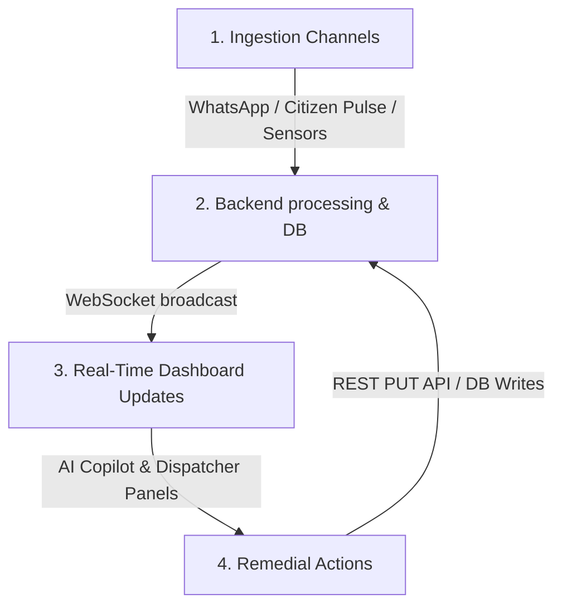

# 🎮 ASTRAM: Command Center Remedies & Incident Testing Playbook

This playbook documents the real-time simulation cycles, data ingestion channels, machine learning-driven evaluations, and interactive dispatcher remedies available within the **ASTRAM Traffic Orchestration Command Center**. 

Use this guide to test the end-to-end event-driven loop—from incident spawning and NLP ingestion to predictive telemetry scoring and tactical resolution.

---

## 1. The Core Real-Time Ingestion Loop

ASTRAM works as an event-driven loop structured in four phases:

### Ingestion Channels
*   **WhatsApp Field Bot (`WhatsAppBot.tsx`)**: Field reports from traffic officers (using multilingual NLP parsing and computer vision classification).
*   **Citizen Pulse (`CitizenPulse.tsx`)**: Natural language social media sentiment monitoring (scanning for keywords like *pothole*, *flooding*, *waterlogging*).
*   **Live Anomaly Radar (`OrchestrationPanels.tsx`)**: IoT speed sensor alerts showing sudden speed drops (e.g., Hosur Road average speed falling by 86%).

---

## 2. Ingestion & Logging Workflows (Test Scenarios)

### Scenario A: Ingesting Field Reports via WhatsApp
1. Open the **WhatsApp Field Officer Bot** widget (or click "Open in New Tab" to access `/whatsapp` fullscreen).
2. Click any quick command chip, for example: `⚠️ Accident Silk Board`.
3. The mock NLP model matches the entities:
   * **Event type**: `accident`
   * **Location**: `Silk Board Junction` (lat: `12.9176`, lon: `77.6244`)
   * **Description**: Unstructured field report text.
4. **Observe Toast Notification**: A success toast appears at the bottom-left indicating the backend has successfully written the incident to the SQLite database and assigned it a unique UUID (e.g. `FKID728192`).
5. **Dashboard Sync**: Look at the **Digital Twin Map** and **Incident Triage Queue**. The new incident marker automatically appears and flashes to indicate it is newly reported.

### Scenario B: Parsing Social Feeds via Citizen Pulse
1. Navigate to the **Citizen Pulse** panel (or `/pulse` fullscreen).
2. Scan the live feed of citizen alerts. Look for an alert such as *"Huge pothole on Tumkur Road near toll plaza, causing massive slowdowns!"*.
3. Click the **Log Ticket** action button next to the tweet.
4. **Observe Database Sync**: The post is geocoded and logged as a new `pot_holes` incident at Tumkur Road, triggering a real-time state broadcast to the map and metrics dials.

---

## 3. Machine Learning Analytics & Telemetry

When an incident is logged, it bypasses static heuristics and triggers real-time predictive models on the backend:

1.  **Commuter Impact Score (CIS) Model**:
    *   Calculates a dynamic congestion score from `0` to `100` based on vehicle types involved (heavy vs. passenger), location capacity (corridor vs. link), weather conditions, and peak rush-hour factors.
    *   **Dashboard Result**: The **Commuter Impact Score Dial** (`CisDial.tsx`) updates its color gauge and needle position.
2.  **Dynamic SLA Time-to-Resolution (TTR) Model**:
    *   Forecasts the expected hours required to resolve the event using historical clearance cycles (e.g. accidents resolved in <1 hour; potholes taking 15+ days).
    *   **Dashboard Result**: The **Incident Triage Queue** (`IncidentFeed.tsx`) and **SLA Lifecycle Command** (`IncidentTracker.tsx`) register the custom SLA target.

---

## 4. Dispatcher Remedial Actions (Resolution Workflows)

When an incident is active, the dispatcher can take multiple actions to resolve it and mitigate traffic cascades:

### Remedy A: Incident Lifecycle Enforcement
*   **Acknowledge**: Click the incident in the **Incident Triage Queue** to load it in the **SLA Lifecycle Command**. Click **Acknowledge Receipt** to record the dispatcher first-response time.
*   **Assign**: Choose an available officer from the list (e.g., Suresh Gowda or Kumar Swamy) based on their specialization and current workload. Click their name to dispatch them.
*   **Escalate**: If an incident is nearing or has breached its ML TTR target:
    1. Click **Escalate Alert**.
    2. The incident escalates along the administrative chain (*Field Officer → Station Inspector → ACP Traffic → DCP East/West → Commissioner*).
    3. **Observe visual cue**: The incident status changes to "OVERDUE", a pulsing red ring appears, and the Triage Queue displays a warning badge.
*   **Resolve & Close**: Once cleared by field crews, click **Mark Resolved**, followed by **Close Incident Case** to archive the record and free up assigned officers.

### Remedy B: Monsoon Flood Mitigation Protocol
1. On the **Weather-Traffic Fusion Engine** panel, click the **TRIGGER FLOOD** button (available during downpours).
2. This creates a severe waterlogging ticket at the **BSNL CACT Underpass** on the Outer Ring Road.
3. The citywide Commuter Impact Score spikes due to the critical blockage.
4. **Remedy**: Click the **DEPLOY PUMPS** action button.
5. **Observe Response**: The SWD (Storm Water Drain) pump teams are marked deployed, reducing the water logging impact score, which dynamically lowers the citywide CIS indicator.

### Remedy C: Signal Recalibration & Green Wave Override
*   **Webster Signal Recalibration**:
    1. Navigate to the **Orchestration Suite** under the **Signals & VIP** tab.
    2. Find junctions showing a *Webster Recommendation Available* status.
    3. Click **Apply**.
    4. The backend adjusts signal green-split intervals to favor the congested approaches, increasing vehicle flow efficiency (e.g., `+18% Flow`). A success toast confirms the adjustment.
*   **Emergency Corridor (Green Wave)**:
    1. Click the **ACTIVATE EMERGENCY CORRIDOR** button at the bottom of the Signals tab, or click a junction directly on the **Digital Twin Map** and choose **Trigger Green Wave Override**.
    2. This sets a continuous green light phase along the designated path (e.g. Chinnaswamy Stadium corridors for ambulance/VIP clearance).
    3. **Observe Visual**: The corridor on the map turns cyan and pulses with a green wave dashboard badge.

### Remedy D: Tactical Barricades & Diversions
*   **Barricade Planner**:
    1. On the **Tactical Dev** tab of the Orchestration Suite, click **Deploy** next to key barricade checkpoints (e.g., MG Road Link, Cubbon Road Entry).
    2. Alternatively, click **any coordinate directly on the Digital Twin Map** and choose **Place Temporary Barricade**.
    3. **Observe State**: The checkpoint updates to `deployed`, drawing a barricade barrier icon on the live map and alerting nearby patrol vehicles.
*   **Corridor Diversions**:
    1. Click a corridor line on the map (e.g., Hosur Road or ORR East 2) and select **Toggle Diversion Flow**.
    2. This activates alternative routes, inoculating the main corridor from congestion cascades and reducing the overall Commuter Impact Score by 18 points.
